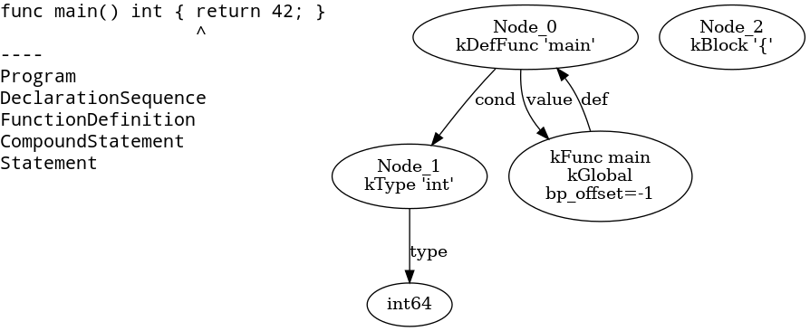
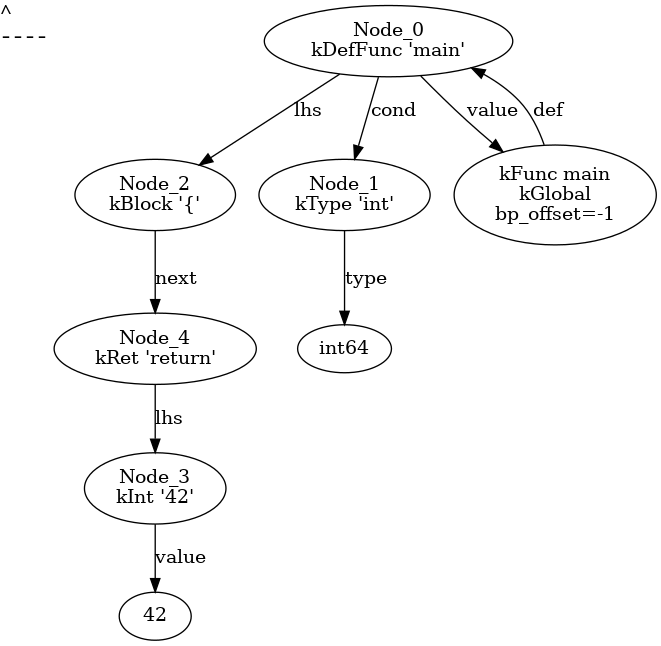

# コンパイルアニメーション生成

OpeLa コンパイラ Ver.2 には実験的にコンパイル処理のアニメーション生成機能が実装
されています。この機能を使うことで、OpeLa コンパイラがコンパイル処理を進める過程
を可視化できます。

## 生成されるアニメーションの例

現在のところ、構文解析の進行状況を表す関数の呼び出し階層（スタックの階層）と、
生成された AST ノードの木構造をアニメーションにすることができます。`func main()
int { return 42; }` という OpeLa プログラムをコンパイルする過程をアニメーション
にしてみたのが下図です。

左上に表示されているのがコンパイル対象のソースコードです。矢印は処理中のトークン
の位置を指しています。構文解析が進むにつれ右に移動していくのが分かります。

左側は関数のコールスタックを表示しています。現在のところ再帰下降型構文解析法を用
いているため、関数が再帰的に呼び出される様子が映し出されています。

右側は構文解析処理が生成した AST（抽象構文木）を表示しています。構文解析の進行に
ともなって木が大きくなっていく様子が分かります。

## 構文解析アニメーションの生成方法

構文解析アニメーションの生成は大きく 2 段階に分かれます。アニメーション生成に必
要なファイル群を生成する処理と、それらを用いてアニメーションを生成する処理です。

1 段階目は `opelac` コマンドにオプションを指定し、必要なファイル群を生成します。
アニメーション生成対象のソースコードを foo.opl とすると、次のコマンドを実行しま
す。

    $ cat foo.opl | ./opelac -gen-parse-anime parse_anime_foo

`parse_anime_foo` は（存在しない）ディレクトリ名を指定します。opelac コマンドは
指定されたディレクトリに素材となるファイル群を生成します。

- `parse_anime_foo/i/stack.txt` : 時刻 i における関数のコールスタック
- `parse_anime_foo/i/ast.dot` : 時刻 i における AST を Dot 言語で記したもの

次に `gen_parse_anime.sh` コマンドを使って各ページの画像と、それらを結合した GIF
アニメーションを生成します。このコマンドを実行するためには、事前に Dot の処理系
と ImageMagick がインストールされている必要があります。

    $ ./gen_parse_anime.sh parse_anime_foo

この処理により、次のファイルが生成されます。

- `parse_anime_foo/i/stack.gif` : stack.txt を画像化したもの
- `parse_anime_foo/i/ast.gif` : ast.dot を画像化したもの
- `parse_anime_foo/page_i.gif` : stack.gif と ast.gif を結合したもの
- `parse_anime_foo/anime.gif` : 全ページを連結したアニメーション

どのような画像が生成されるか興味のある方向けに、`parse_anime_hello/anime.gif` に
含まれるページをいくつか紹介します。

- ページ 10: 
- ページ 39: 
